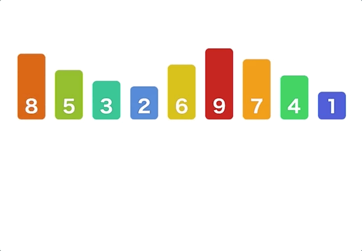

# Retour sur les tris

## Implantation des tris

On propose ci-dessous d'implanter dans un même fichier python, les deux fonctions permettant de réaliser :

- le tri par sélection ;
- le tri par insertion.

Pour commencer, vous êtes invité à télécharger le fichier  [tris.py](<./files/tris.py>)

### Le tri par sélection

On rappelle que le **tri par sélection** repose sur l'échange entre l'élément d'indice $i$ et le minimum de la liste à partir de l'indice $i$.

<center>
    
</center>

Pour réaliser un tri par sélection, on propose la structure de code suivante :

``` python title="Implantation du tri par sélection" linenums="1"

def tri_selection(L:list) -> None:
    """
        Réalise un tri par sélection d'une liste L
    """
    n = len(L)
    for i in range(...):
        mini = ...
        for j in range(..., ...):
            if L[...] < L[...]:
                mini = ...
        if i != mini:
            L[i], L[mini] = L[mini], L[i]
```

!!! question "Pour commencer"

    1. Compléter le code ci-dessus pour qu'il réalise un tri complet par sélection.
    2. Définir la variable `L = [14, 4, 19, 12, 7, 2, 10, 24, 9]`.
        1. Que renvoie l'instruction `tri_selection(L)` ?
        2. Vérifier que la liste est bien triée malgré tout.
        3. Combien de comparaisons ont été utilisées pour trier cette liste ?

??? bug "Correction"

    On donne ci-dessous le code complet pour la fonction `tri_selection(L:list) -> None` :

    ``` python title="Implantation du tri par sélection" linenums="1"

    def tri_selection(L:list) -> None:
        """
            Réalise un tri par sélection d'une liste L
        """
        n = len(L)
        for i in range(n-1):
            mini = i
            for j in range(i+1, n):
                if L[j] < L[mini]:
                    mini = j
            if i != mini:
                L[i], L[mini] = L[mini], L[i]
    ```

### Le tri par insertion

Contrairement au tri par sélection, le **tri par insertion** repose sur le décalage vers la gauche du $i$-ième élément tant qu'il n'est pas situé à la bonne place.

<center>
    
</center>

Pour réaliser un tri par insertion, on propose la structure de code suivante :

``` python title="Implantation du tri par insertion" linenums="1"

def tri_insertion(L:list) -> None:
    """
        Réalise un tri par insertion d'une liste L
    """
    n = len(L)
    for i in range(..., ...):
        x = L[...]
        j = ...

        while ... and L[...] > x:
            L[j] = L[...]
            j = j-1

        L[j] = x
```

!!! question "Pour commencer"

    1. Compléter le code ci-dessus pour qu'il réalise un tri complet par insertion.
    2. Définir la variable `L = ["David", "Laurie", "Bastien", "Alexis", "Edouard", "Lily", "Lea", "Juliette"]`.
        1. Que renvoie l'instruction `tri_insertion(L)` ?
        2. Vérifier que la liste est bien triée malgré tout.
        3. Combien de comparaisons ont été utilisées pour trier cette liste ? 

??? bug "Correction"

    On donne ci-dessous le code complet pour la fonction `tri_insertion(L:list) -> None` :

    ``` python title="Implantation du tri par insertion" linenums="1"

    def tri_insertion(L:list) -> None:
        """
            Réalise un tri par insertion d'une liste L
        """
        n = len(L)
        for i in range(1, n):
            x = L[i]
            j = i

            while j > 0 and L[j-1] > x:
                L[j] = L[j-1]
                j = j-1

            L[j] = x
    ```

## Application sur des données abstraites

<center>
    
</center>

Une fuite de données a concerné le serveur pronote du lycée Colbert.  
On a pu récupérer l'ensemble de la liste des élèves avec leur genre et leur date de naissance.

### Modélisation

Pour modéliser un élève du lycée Colbert, on propose d'utiliser un tuple nommé avec trois attributs :

- l'identité de l'élève ;
- le genre de l'élève (`"G"` ou `"F"`) ;
- la date de naissance de l'élève.

Pour commencer, vous êtes invité à télécharger le fichier  [colbert.py](<./files/colbert.py>)

!!! question "Création d'un élève"

    1. Proposer un code permettant d'implanter la fonction `creer_date(d:str) -> tuple` ;
    2. À l'aide de cette fonction, compléter le code de la fonction `creer_eleve(L:list) -> tuple`.

??? tip "Indications"

    1. Pour convertir une chaine de caractères en entier, on utilise la fonction `int`. Il faut également couper la chaine de caractères avec la méthode `split`.
    2. Associer les éléments de la liste aux bons attributs du tuple.

??? bug "Correction"

    1. Pour la fonction `creer_date(d:str) -> tuple`, on propose le code :

    ``` python title="Création d'une date" linenums="1"

    def creer_date(d:str) -> tuple:
        """
            Convertir une chaine "jj/mm/aaaa" en tuple (jj, mm, aaaa)
        """
        buff = d.split('/')
        return (int(buff[0]), int(buff[1]), int(buff[2]))
    ```
    2. Pour la fonction `creer_eleve(L:list) -> tuple`, on a alors :

    ``` python title="Création d'un élève" linenums="1"

    def creer_eleve(L:list) -> tuple:
        """
            Créer un élève à partir d'une liste de chaine de caractères.
        """
        return eleve(L[0], L[2], creer_date(L[1]))
    ```

### Chargement des données

<center>
    
</center>

Pour commencer, vous êtes invité à télécharger le fichier  [eleves.csv](<./files/eleves.csv>) ainsi que le fichier de test [test.csv](<./files/test.csv>).

!!! question "Quelques essais"

    1. Dans la console, taper les instructions :

        - `f = open("test.csv", encoding="utf-8")` ;
        - `L = f.readlines()` ;
        - `f.close()`.
    2. Observer ce que contient la liste `L`.
    3. Taper alors l'instruction `L = [el[:-1] for el in L]` puis observer à nouveau la liste `L`.
    4. Taper enfin l'instruction `L = [el.split(',') for el in L]` puis observer à nouveau la liste `L`.
    5. Proposer un code complet de la fonction `charger_data() -> list` qui charge les élèves du fichier **eleves.csv**.

??? bug "Correction"

    Pour la fonction `charger_data() -> list`, on propose le code suivant :

    ``` python title="Chargement des élèves" linenums="1"

    def charger_data() -> list:
        """
            Chargement des élèves depuis le fichier eleves.csv
        """
        f = open("eleves.csv", encoding="utf-8")
        L = f.readlines()
        f.close()
        L = [el[:-1].split(',') for el in L]

        res = []
        for elt in L:
            res.append(creer_eleve(elt))
        return res

    ```

### Tris et comparaisons d'élèves

<center>
    
</center>

!!! question "Pour aller plus loin"

    1. Vérifier que l'instruction `colbert = charger_data()` charge bien l'ensemble des élèves du lycée.
    2. Trier cette liste avec un tri par sélection et observer le classement par ordre alphabétique.
    3. Implanter dans le fichier **tris.py** une méthode `cmp_eleve(el1:tuple, el2:tuple) -> int` qui compare les élèves suivant la règle :
        - si l'élève 1 est plus jeune que l'élève 2, alors cette fonction renvoie 1 ;
        - si l'élève 1 est plus vieux que l'élève 2, alors cette fonction renvoie -1 ;
        - si l'élève est né le même jour que l'élève 2, alors on trie par ordre alphabétique du nom.
    4. Modifier alors la fonction **tri_insertion** pour prendre en compte cette fonction de comparaison.
    5. Trier la liste `colbert` grâce à un tri par insertion.